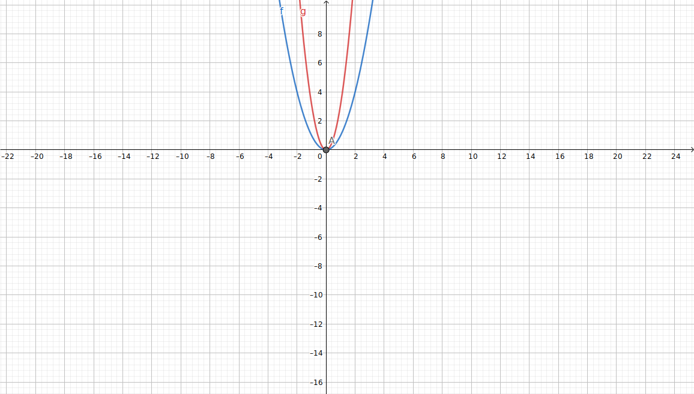

<!--
logo: ./new_oer_portal_logo.svg

icon: ./twillo_logo.svg

script:   https://h5p.org/sites/all/modules/h5p/library/js/h5p-resizer.js

import:   https://h5p.org/sites/all/modules/h5p/library/js/h5p-resizer.js

-->

# Testing...

## More..

<iframe src="https://www.falstad.com/circuit/" width="100%" height="600px" overflow="auto" frameborder="0" allowfullscreen="allowfullscreen"></iframe>

## Else..

<iframe src="https://www.falstad.com/circuit/" width="100%" height="auto" overflow="auto" frameborder="0" allowfullscreen="allowfullscreen"></iframe>

---

<iframe src="https://www.falstad.com/circuit/" width="100%" height="auto" overflow="auto" frameborder="0" allowfullscreen="allowfullscreen" onload="autoResize(this)"></iframe>

<iframe src="https://www.falstad.com/circuit/" width="100%" height="auto" overflow="auto" frameborder="0" allowfullscreen="allowfullscreen" onload="resizeIframe(this)"></iframe>

---

<iframe id="testiframe" src="https://www.falstad.com/circuit/" width="100%" height="auto" overflow="auto" frameborder="0" allowfullscreen="allowfullscreen" onload="autoResize(this)"></iframe>

## Pop-Ups

PNG Img.:

### SVGs

1. ("good" svg)

relative path:   

absolute raw path:  

with cdn:     

HTML:

---

2. ("bad" svg)

relative path:   

absolute raw path:  

with cdn:     

HTML:

---

3. ("bad" svg)

relative path:   

absolute raw path:  

with cdn:     

---

4. ("bad" svg)

relative path:   

absolute raw path:  

with cdn:     

---
---

5. more tests..

relative path:

## H5P

**Multiple Choice via H5P:**

<iframe src="https://h5p.org/h5p/embed/1067028" width="100%" height="420" frameborder="0" allowfullscreen="allowfullscreen" allow="geolocation *; microphone *; camera *; midi *; encrypted-media *" title="Multiple Choice Test - Physik Course"></iframe>

**More H5P:**

<iframe src="https://h5p.org/h5p/embed/1023722" width="100%" height="200" frameborder="0" allowfullscreen="allowfullscreen" allow="geolocation *; microphone *; camera *; midi *; encrypted-media *" title="Collapse"></iframe>

<iframe src="https://h5p.org/h5p/embed/1067030" width="100%" height="350" frameborder="0" allowfullscreen="allowfullscreen" allow="geolocation *; microphone *; camera *; midi *; encrypted-media *" title="Input Field - Physik course"></iframe>

### Sizing

#### 1

<iframe src="https://raw.githack.com/TorroRosso46/LiaScript_DynamischeDatenstrukturen/master/docs/h5p/GLQ_compact.html" width="100%" height="759" frameborder="0" scrolling="no"></iframe>

#### 2

<iframe src="https://raw.githack.com/TorroRosso46/LiaScript_DynamischeDatenstrukturen/master/docs/h5p/GLQ_compact.html?embed=true" width="100%" height="700px" frameborder="0"></iframe>

#### 3

<iframe src="https://raw.githack.com/TorroRosso46/LiaScript_DynamischeDatenstrukturen/master/docs/h5p/GLQ_compact.html" width="649" height="759" overflow="auto" scrolling="no" frameborder="0"></iframe>

## Geogebra

<iframe scrolling="no" title="Addition und Subtraktion Ganzer Zahlen an der Zahlengerade" src="https://www.geogebra.org/material/iframe/id/GFQHactE/width/682/height/400/border/888888/sfsb/true/smb/false/stb/false/stbh/false/ai/false/asb/false/sri/true/rc/false/ld/false/sdz/true/ctl/false" width="682px" height="400px" style="border:0px;"> </iframe>

<iframe scrolling="no" title="test" src="https://www.geogebra.org/material/iframe/id/nxqztapz/width/700/height/500/border/888888/sfsb/true/smb/false/stb/false/stbh/false/ai/false/asb/false/sri/false/rc/false/ld/false/sdz/true/ctl/false" width="700px" height="500px" style="border:0px;"> </iframe>

---

<iframe src="https://www.geogebra.org/classic/ptsc7ezz?embed" width="800" height="600" allowfullscreen style="border: 1px solid #e4e4e4;border-radius: 4px;" frameborder="0"></iframe>

---

**SVG:**

### complete app embedding

---

<lia-keep>
<html>
<head>
        <title>Apps with Toolbar: Graphing Calculator</title>
        <meta http-equiv="Content-Type" content="text/html; charset=utf-8" />
		
</head>

<body>

        <h1>Apps with Toolbar: Graphing Calculator</h1>
        
This page shows how to embed GeoGebra Graphing Calculator without construction in a webpage.
        For details about customization please refer to <a href="https://wiki.geogebra.org/en/Reference:Applet_Parameters">documentation</a>. Please check out embedding examples for our other apps:

          <a class="btn active" id="app_graphing" href="example-graphing.html">Graphing Calculator</a>
        <a class="btn" id="app_geometry" href="example-geometry.html">Geometry</a>
        <a class="btn" id="app_classic" href="example-tools.html">Classic</a>
        

        

        

		

</body>
</html>
</lia-keep>

---

<lia-keep>
<!DOCTYPE html>
<html>

<head>
        <title>GeoGebra Graphing Calculator in Popup Dialog</title>
        <meta http-equiv="Content-Type" content="text/html; charset=utf-8" />
		
		
		
		 <link rel="stylesheet" href="https://code.jquery.com/ui/1.12.1/themes/base/jquery-ui.css">
		
</head>

<body>

        <h1>GeoGebra Graphing Calculator in Popup Dialog</h1>
        
This demo shows embedding of <a href="example-graphing.html">GeoGebra Graphing Calculator</a> into a draggable dialog. The dialog is provided by <a href="https://jqueryui.com/draggable/">JQueryUI</a>.

        

        
		

		<a href="#" onclick="start();return false;" class="btn app-icon-graphing">Graphing calculator</a>
		

  

		
		

</body>

</html>
</lia-keep>
